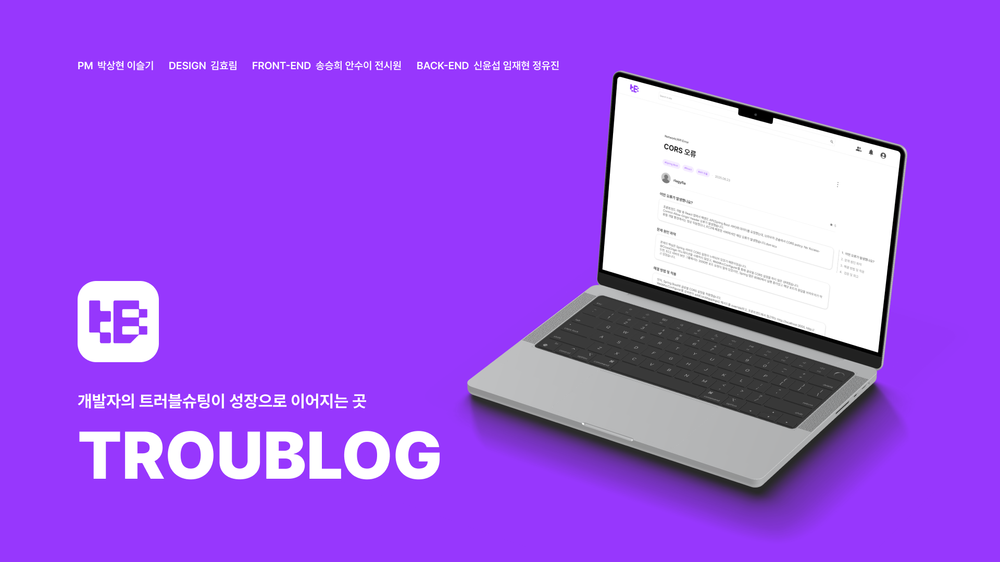
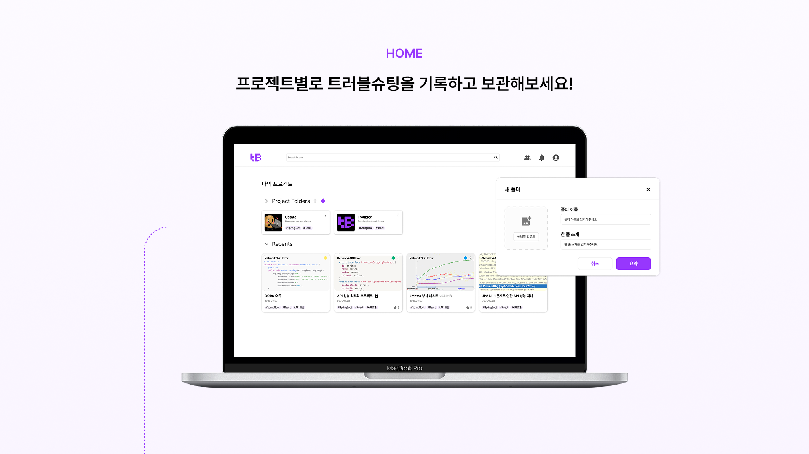
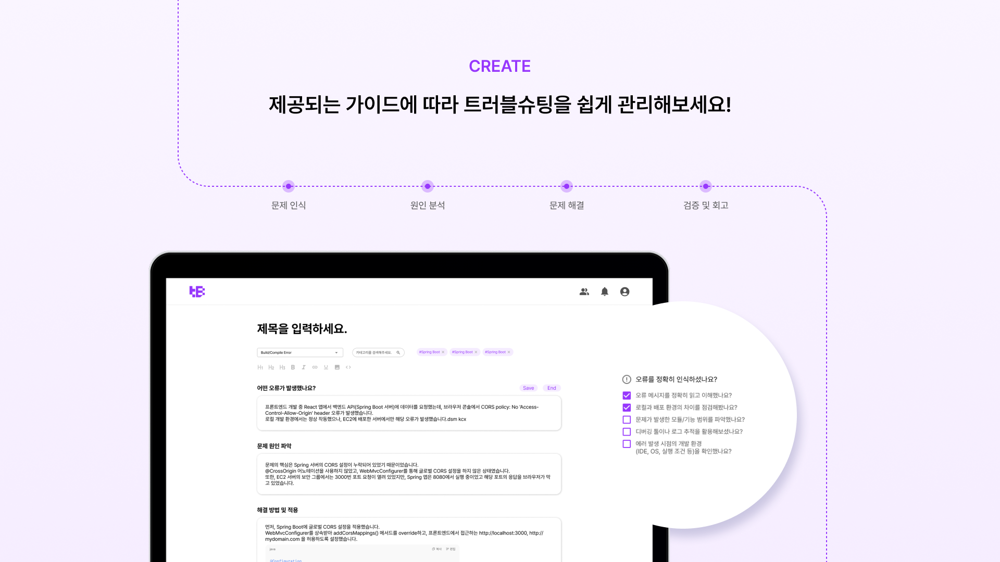
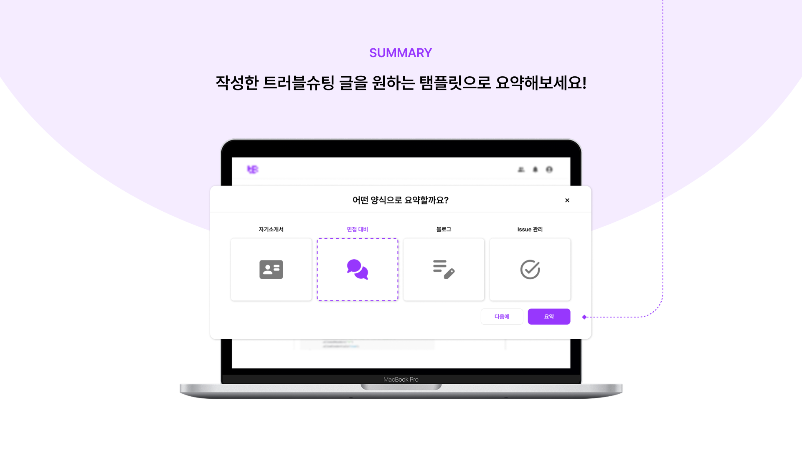
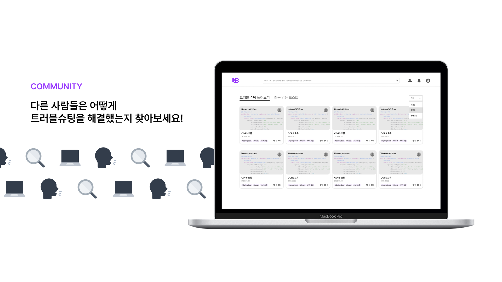
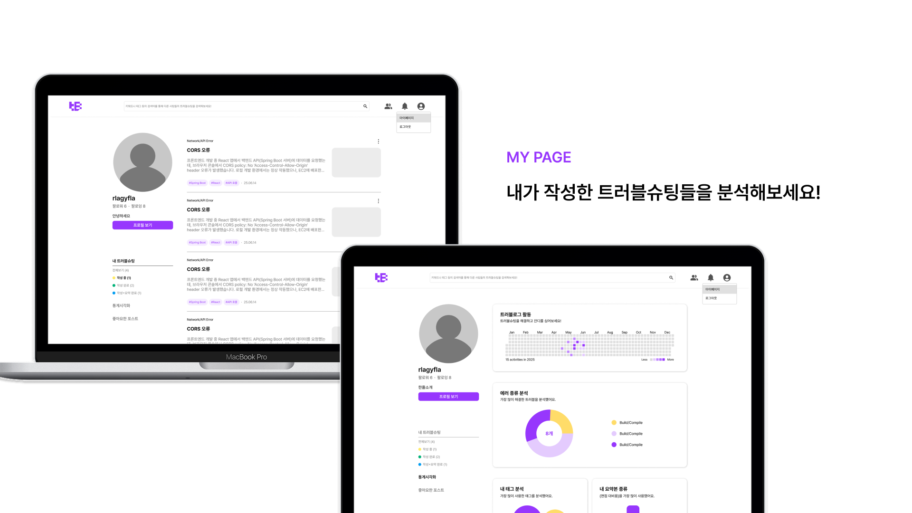
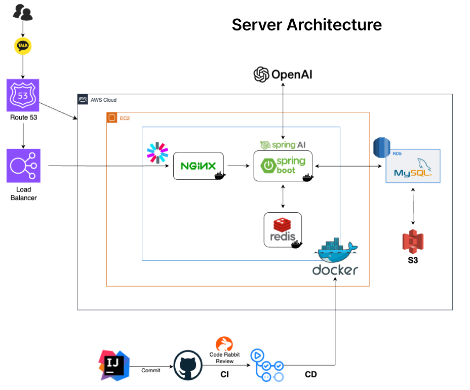

<div align="center">

#  Troublog BE

<!--배지-->


<!--프로젝트 버튼-->
[![배포 링크][deploy-shield]][deploy-url] 
[![API 문서][api-docs-shield]][api-docs-url] 
[![이슈 신고][report-bug-shield]][report-bug-url] 
[![기능 요청][request-feature-shield]][request-feature-url]

### ✨ 개발자의 트러블슈팅이 성장으로 이어지는 곳 ✨

</div>

<!--프로젝트 대문 이미지-->



## 📋 목차

### 🔍 프로젝트 소개
- [📖 프로젝트 개요](#프로젝트-개요)
  - [✨ 주요 기능](#주요-기능)
  - [🖥️ 서비스 화면](#서비스-화면)

### 🛠️ 기술 정보  
- [⚙️ 기술 스택 & 아키텍처](#기술-스택--아키텍처)
  - [📦 기술 스택](#기술-스택)
  - [🏗️ 시스템 아키텍처](#시스템-아키텍처)

### 🚀 시작하기
- [⭐ 설치 및 실행](#설치-및-실행)
  - [📋 필수 환경](#필수-환경)
  - [💾 설치 과정](#설치-과정)
  - [🔧 환경 설정](#환경-설정)
  - [▶️ 앱 실행](#앱-실행)

### 📚 사용 가이드
- [📖 API 문서](#api-문서)

### 🔧 문제 해결 & 정보
- [❗ 자주 발생하는 문제](#자주-발생하는-문제)
- [📝 커밋 컨벤션](#커밋-컨벤션)

---

# 📖 프로젝트 개요

> _**Troublog**는 개발자의 트러블슈팅이 성장으로 이어지는 곳입니다._ <br>
> 개발자들이 프로젝트 진행 중 발생하는 문제와 해결 과정을 체계적으로 기록, 
> 관리하고 이를 이력서 및 포트폴리오에 활용할 수 있도록 지원하는 플랫폼으로 개발자들이 트러블 슈팅 경험을 통해 
> 성장하고 유사한 문제 발생 시 빠르게 대처할 수 있는 환경을 제공하는 서비스 입니다. 
## ✨ 주요 기능

- 🐛 **트러블슈팅 포스트 작성**: 문제 상황부터 해결까지의 과정을 단계별로 기록
- 🏷️ **태그 시스템**: 기술 스택별, 문제 유형별 분류로 원하는 글을 빠르게 검색
- ⭐ **평가 기능**: 다른 개발자들이 해결책의 유용성을 별점으로 평가 
- 👥 **팔로우 시스템**: 관심있는 개발자의 트러블슈팅 경험을 지속적으로 확인
- 📊 **프로젝트별 관리**: 진행중인 프로젝트에서 발생한 문제들을 모아서 관리
- ❤️ **좋아요 & 댓글**: 도움이 된 글에 반응하고 추가 정보나 의견 공유
- 🖼️ **이미지 업로드**: 에러 스크린샷이나 코드 이미지를 첨부해서 문제 상황을 명확히 전달
- 📈 **개인 통계**: 내가 해결한 문제 유형과 주로 사용하는 기술 스택 분석

## 🖥️ 서비스 화면

<table>
  <tr>
    <td align="center" width="50%">
      
      <br/><b>프로젝트별 트러블슈팅 관리</b><br/>
      프로젝트별 트러블슈팅 관리 및 보관
    </td>
    <td align="center" width="50%">
      
      <br/><b>가이드라인 기반 관리</b><br/>
      가이드라인에 따른 트러블슈팅 관리
    </td>
  </tr>
</table>

<table>
  <tr>
    <td align="center" width="33%">
      
      <br/><b>AI 템플릿 요약</b><br/>
      AI를 이용한 템플릿 요약
    </td>
    <td align="center" width="33%">
      
      <br/><b>커뮤니티 기능</b><br/>
      개발자 간 소통 및 지식 공유
    </td>
    <td align="center" width="34%">
      
      <br/><b>트러블슈팅 분석</b><br/>
      트러블슈팅 분석 및 통계
    </td>
  </tr>
</table>

---

# ⚙️ 기술 스택 & 아키텍처


## 📦 기술 스택

---

### Backend Framework


### Database & Storage


### Infrastructure & DevOps


### Security & Authentication


### Development Tools


## 🏗️ 시스템 아키텍처

---

<div align="center">
  
  <br/><b>Troublog 시스템 아키텍처</b>
</div>

> **Note**  
> 도메인 주도 설계(DDD)와 CQRS 패턴을 기반으로 한 확장 가능한 아키텍처를 적용했습니다.

**주요 설계 원칙:**
- **도메인별 패키지 분리**: trouble, user, auth, project, like, image, statistics
- **계층형 아키텍처**: Controller → Service → Repository → Entity
- **CQRS 패턴**: 명령과 조회 작업 분리
- **Facade 패턴**: 복잡한 비즈니스 로직 통합 관리 
- **Soft Delete**: 데이터 안전성을 위한 논리 삭제

---

# ⭐ 설치 및 실행

## 📋 필수 환경

---

> **Warning**  
> 프로젝트 실행 전에 반드시 아래 환경을 확인해주세요.

**필수 환경:**
- **Java 21** - [OpenJDK 21 다운로드](https://openjdk.org/projects/jdk/21/)
- **MySQL 8.0** - [MySQL Community Server](https://dev.mysql.com/downloads/mysql/)
- **Git** - 버전 관리 및 소스코드 클론

```bash
# 개발 환경 확인
java --version    # Java 21 이상
mysql --version   # MySQL 8.0 이상
git --version     # Git 2.0 이상
```

## 💾 설치 과정

---

1. **Repository 클론**
```bash
git clone https://github.com/IT-Cotato/11th-Troublog-BE.git
cd 11th-Troublog-BE
```

2. **데이터베이스 준비**
```bash
# MySQL 서버 시작 후 데이터베이스 생성
mysql -u root -p
CREATE DATABASE troublog CHARACTER SET utf8mb4 COLLATE utf8mb4_unicode_ci;
EXIT;
```

## 🔧 환경 설정

---

> **Note**  
> 보안을 위해 실제 키 값들은 별도로 관리해주세요.

`src/main/resources/application-local.yml` 파일을 생성하고 다음 설정을 추가하세요:

```yaml
spring:
  profiles:
    active: local
  datasource:
    url: jdbc:mysql://localhost:3306/troublog?useUnicode=true&characterEncoding=utf8mb4&serverTimezone=Asia/Seoul
    username: your-mysql-username
    password: your-mysql-password
    driver-class-name: com.mysql.cj.jdbc.Driver

jwt:
  secret-key: your-jwt-secret-key-at-least-256-bits

aws:
  s3:
    access-key: your-s3-access-key
    secret-key: your-s3-secret-key
    bucket: your-s3-bucket-name
    region: ap-northeast-2

openai:
  api-key: your-openai-api-key
```

## ▶️ 앱 실행

---

**개발 모드 실행**
```bash
# Gradle을 통한 개발 서버 실행
./gradlew bootRun --args='--spring.profiles.active=local'
```

**프로덕션 빌드 및 실행**
```bash
# JAR 파일 빌드
./gradlew clean build

# 빌드된 애플리케이션 실행
java -jar build/libs/troublog-*.jar --spring.profiles.active=prod
```

> **Note**  
> 애플리케이션이 성공적으로 실행되면 `http://localhost:8080`에서 확인할 수 있습니다.

---

# 📖 API 문서

---

- 📖 **[API 명세서](https://troublog.shop/swagger-ui/index.html#/)** 

## 💡 핵심 기능 API

---


### 🔐 인증 (JWT + OAuth 2.0)
```bash
POST /auth/login              # 일반 로그인
POST /auth/oauth/google       # 구글 소셜 로그인  
POST /auth/refresh            # 토큰 갱신
```

### 📝 트러블슈팅 포스트
```bash
GET  /api/posts               # 포스트 목록 조회
POST /api/posts               # 새 포스트 작성
GET  /api/posts/{id}          # 상세 조회
```

### 🤖 AI 요약 기능 (핵심)
```bash
POST /api/ai/summarize        # 트러블슈팅 내용 AI 요약
POST /api/ai/suggest-tags     # AI 기반 태그 추천  
POST /api/ai/similar-posts    # 유사 포스트 추천
```

### 👥 소셜 기능
```bash
POST /api/users/follow/{userId}    # 팔로우/언팔로우
POST /api/posts/{id}/like         # 좋아요/좋아요 취소
POST /api/posts/{id}/comments     # 댓글 작성
```

모든 API 엔드포인트와 상세 스펙은 **[API 명세서](https://troublog.shop/swagger-ui/index.html#/)** 에서 확인하실 수 있습니다.

---

# ❗ 자주 발생하는 문제

### 🔑 JWT Secret Key Missing

---

- **해결**: `application-local.yml`에 최소 256비트 `jwt.secret-key` 추가

### 🗄️ Database Connection Failed  

---

- **해결**: MySQL 서버 상태 및 연결 정보 확인
```bash
systemctl status mysql  # Linux
net start mysql80       # Windows
```

### ☁️ S3 Upload Failed

---

- **해결**: AWS IAM 사용자 S3 권한 확인 (`s3:PutObject`, `s3:GetObject`)

### 🤖 OpenAI API Rate Limit

---

- **해결**: API 키 사용량 확인 및 요청 빈도 조절


# 📝 커밋 컨벤션

---

- ✨ `feat`: 새로운 기능 추가
- 🐛 `fix`: 버그 수정 및 오류 해결  
- 📝 `docs`: 문서 개선 및 업데이트
- 🔨 `refactor`: 코드 리팩토링 및 구조 개선
- ⚡ `perf`: 성능 향상 및 최적화

상세한 컨벤션은 **[트러블로그 BE 커밋 컨벤션](https://wary-hockey-4ec.notion.site/1cc5424182c7804fb249f2f4963eb4c6?source=copy_link)** 를 참고하세요.

---

## 🏢 BACKEND TEAM

---
<table>
  <tr>
    <td align="center" width="200px">
      <a href="https://github.com/supsup-hae" target="_blank">
        
      </a>
    </td>
    <td align="center" width="200px">
      <a href="https://github.com/jay91537" target="_blank">
        
      </a>
    </td>
    <td align="center" width="200px">
      <a href="https://github.com/marshmallowing" target="_blank">
        
      </a>
    </td>
  </tr>
  <tr>
    <td align="center">
      <a href="https://github.com/supsup-hae" target="_blank">
        <h3>신윤섭</h3>
        <p>Backend Team Leader</p>
      </a>
    </td>
    <td align="center">
      <a href="https://github.com/jay91537" target="_blank">
        <h3>임재현</h3>
        <p>Backend Developer</p>
      </a>
    </td>
    <td align="center">
      <a href="https://github.com/marshmallowing" target="_blank">
        <h3>Youjin</h3>
        <p>Backend Developer</p>
      </a>
    </td>
  </tr>
</table>

# License

---

> 💡 이 프로젝트는 오픈소스 프로젝트로, MIT 라이선스 하에 자유롭게 사용하실 수 있습니다.

```
MIT License

Copyright (c) 2025 IT-Cotato Troublog Team

Permission is hereby granted, free of charge, to any person obtaining a copy
of this software and associated documentation files (the "Software"), to deal
in the Software without restriction, including without limitation the rights
to use, copy, modify, merge, publish, distribute, sublicense, and/or sell
copies of the Software, and to permit persons to whom the Software is
furnished to do so, subject to the following conditions:

The above copyright notice and this permission notice shall be included in all
copies or substantial portions of the Software.
```

---

<div align="center">

### ✨ **Troublog와 함께 더 나은 개발 경험을 만들어가세요!** ✨

**🚀 지금 시작해보세요** | **🤝 커뮤니티 참여** | **💡 아이디어 제안**

*Made with ❤️ by [11th-Troublog](https://github.com/orgs/IT-Cotato/teams/11th-troublog) Team*

</div>

<!--URL for Badges-->
[deploy-shield]: https://img.shields.io/badge/-troublog.kr-4285F4?style=for-the-badge&logo=googlechrome&logoColor=white
[api-docs-shield]: https://img.shields.io/badge/-API%20문서-85EA2D?style=for-the-badge&logo=swagger&logoColor=white
[report-bug-shield]: https://img.shields.io/badge/-🐞%20버그%20신고-F5A9A9?style=for-the-badge
[request-feature-shield]: https://img.shields.io/badge/-✨%20기능%20요청-A9D0F5?style=for-the-badge

<!--URL for Links-->
[deploy-url]: https://troublog.vercel.app
[api-docs-url]: https://troublog.shop/swagger-ui/index.html#/
[report-bug-url]: https://github.com/IT-Cotato/11th-Troublog-BE/issues
[request-feature-url]: https://github.com/IT-Cotato/11th-Troublog-BE/issues